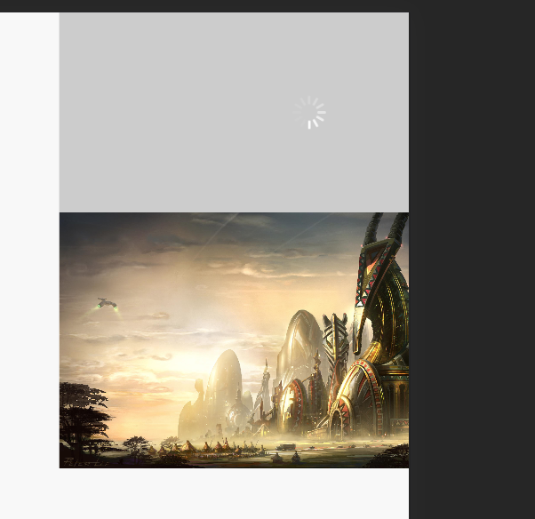

# react_componets

react 组件库   
lib-flexible适配方案    
sass预处理器    
部分依赖better-scroll，会在组件中说明

## 组件目录

#### 菊花组件

效果图

可配置项

    size: 72, // 菊花大小 优先级低于petaHeight
    petalWidth: 4, // 花瓣宽度
    // petalHeight: 18, // 花瓣高度
    petalBorderRadius: 1, // 花瓣圆角大小
    bgColor: '#fff', // 花瓣背景色
    petalNum: 24, // 花瓣数量
    time: 0.05*24, // 转动一圈所用的时间,感觉应该叫cycle(周期) 或者 frequency(频率)好点，
    update: false,// 要不要实时更新？就是动态修改菊花属性的时候会更新

#### loading组件

可配置项

    text: '加载中',

#### 图片懒加载组件

可配置项
    
    src: '',图片地址
    lazy: false, 是否懒加载
    type: 'part'|'all' 图片元素部分可见|完全可见时加载图片
